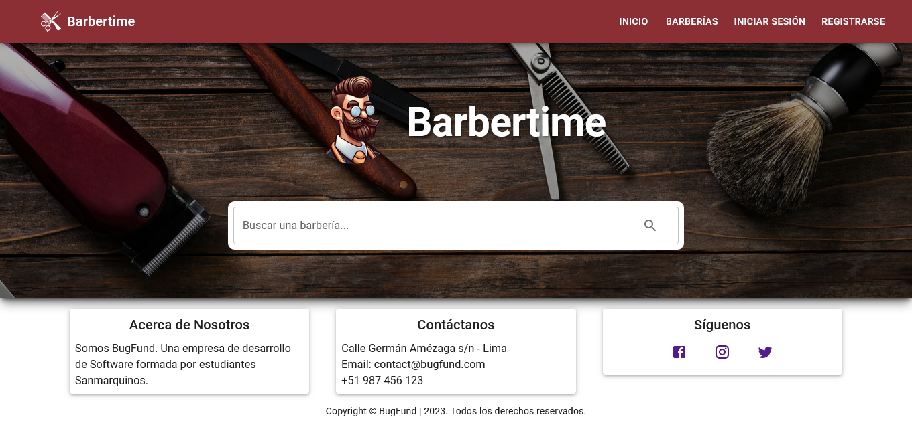

# Proyecto Barbería - Aplicación Web

<!-- TOC -->
* [Proyecto Barbería - Aplicación Web](#proyecto-barbería---aplicación-web)
  * [Tecnologías Utilizadas](#tecnologías-utilizadas)
  * [Instrucciones de Instalación](#instrucciones-de-instalación)
    * [Requisitos](#requisitos)
    * [Pasos](#pasos)
    * [Cómo ejecutar la Aplicación](#cómo-ejecutar-la-aplicación)
    * [Comandos Disponibles](#comandos-disponibles)
  * [Contribuir](#contribuir)
  * [Licencia](#licencia)
<!-- TOC -->

Barbertime es una plataforma de reserva en línea que conecta a los clientes con barberos y barberías en su área. Esta
aplicación web permite a los clientes buscar y descubrir nuevos servicios de barbería basados en su ubicación, ver las
ofertas de servicios de cada barbería, reservar servicios y programar citas. Al mismo tiempo, ofrece a los barberos la
oportunidad de exponer su barbería y los servicios que ofrecen al público, ampliando así su clientela y aumentando su
visibilidad.

## Tecnologías Utilizadas

- React
- Material-UI
- Axios
- ViteJS
- Emotion
- Fontsource Roboto
- MUI Icons Material
- MUI X Date Pickers
- DayJS
- Leaflet
- React Leaflet
- React Router

## Instrucciones de Instalación

### Requisitos

- NodeJS@18.15.0
- NPM@9.5.0

### Pasos

1. Clonar el repositorio a tu local
````shell
git clone https://github.com/JosueEstrada/barbertime-vite-mui.git
```` 
2. Dirigirse a la carpeta del proyecto

````shell
cd barbertime-vite-mui
````

3. Instalar las dependencias

````shell
npm install
```` 

### Cómo ejecutar la Aplicación

Luego de la instalación, puedes ejecutar la aplicación con el comando:
````shell
npm run dev
```` 

Y acceder a través de la url http://localhost:5173/ en tu navegador.
### Comandos Disponibles
* `npm run dev`: Ejecuta el servidor de desarrollo de Vite.
* `npm run build`: Genera una versión de producción del proyecto.
* `npm run lint`: Ejecuta ESLint para detectar problemas en el código.
* `npm run preview`: Ejecuta la versión de producción en un servidor local para su revisión.
## Contribuir
Si deseas contribuir al proyecto, por favor realiza un fork del repositorio, realiza tus cambios y envía un pull
request.
## Licencia
Este proyecto está bajo la licencia MIT.
